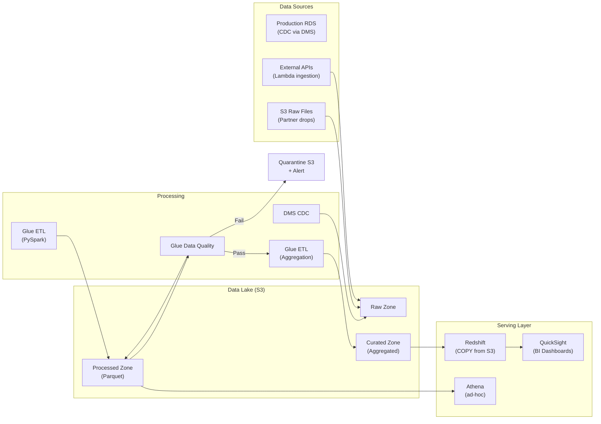

# Big Data Pipeline Architecture

## Problem Statement
Build an end-to-end big data pipeline processing 10 TB/day with batch ETL, data quality, and BI dashboards.

## Architecture Diagram



## Pipeline Orchestration
- **AWS Step Functions**: orchestrate Glue jobs sequentially
- **EventBridge Scheduler**: trigger daily at 02:00 UTC
- **Failure handling**: SNS alert + DLQ for failed Glue jobs
- **Monitoring**: Glue job metrics → CloudWatch → Dashboard

## Data Quality Rules (Glue Data Quality)
```
Rules = [
  IsComplete "customer_id",
  IsUnique "order_id",
  ColumnValues "amount" between 0 and 1000000,
  DataFreshness "created_at" with threshold 2 days
]
```

## Interview Talking Points
- "CDC from DMS means you're getting real-time changes without impacting production DB"
- "Data quality checks before writing to curated layer prevents bad data in BI"
- "Step Functions for pipeline orchestration: visibility, retry logic, failure handling"
- "Parquet + partitioning reduces Redshift COPY time and Athena query costs"
