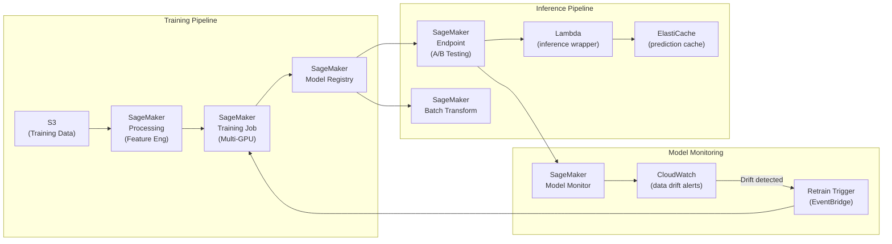

# ML Pipeline Architecture on AWS

## Problem Statement
Build an end-to-end ML pipeline from data ingestion to model serving at scale.

## Architecture Diagram

## Pipeline Stages
1. **Feature Engineering**: SageMaker Processing Jobs (PySpark/scikit-learn containers)
2. **Training**: SageMaker Training with Spot instances (70% savings); distributed training on p3.16xlarge cluster
3. **Registry**: SageMaker Model Registry with approval workflow
4. **Deployment**: Blue/Green endpoint deployment; A/B testing with traffic splitting
5. **Monitoring**: data drift + model drift detection; auto-retrain on drift

## Cost Optimization
- **Spot training**: SageMaker Managed Spot up to 90% savings; checkpointing to S3
- **Inference**: Graviton2 (ml.c7g) for CPU inference; 30% cheaper
- **Batch Transform**: for non-real-time inference; much cheaper than endpoint
- **Multi-model endpoints**: pack multiple models into one endpoint

## Interview Talking Points
- "SageMaker Spot Training is one of the biggest cost levers in ML — 90% savings with checkpointing"
- "Model Registry with approval workflow = MLOps governance (who approved this model?)"
- "Data drift monitoring is often overlooked; model accuracy degrades without it"
- "A/B testing on SageMaker endpoints: traffic split between old and new model; compare metrics"
