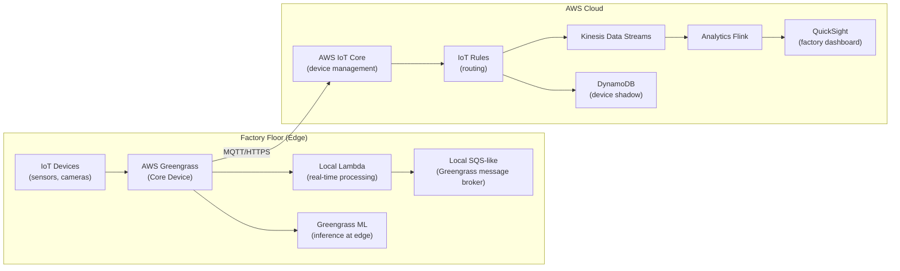

# Edge Computing Architecture

## Problem Statement
Process IoT data at the edge (factory floor) while syncing to AWS cloud for analytics.

## Architecture Diagram

## Edge Processing with Greengrass
- Run Lambda functions locally on edge device
- ML inference at edge: no cloud round-trip for time-sensitive decisions
- Local message broker: continue processing during internet outage
- Sync to cloud: batch or real-time, depending on bandwidth

## Device Shadow (AWS IoT Core)
- Persistent state for each device (last known good state)
- Device shadow document: `desired` + `reported` state
- App updates `desired`; device updates `reported`; IoT Core syncs
- Use case: send command to offline device; executed when it reconnects

## Interview Talking Points
- "Edge computing is about latency and bandwidth: run ML at the edge, sync insights to cloud"
- "Device Shadow is the key IoT pattern: desired vs reported state handles offline devices"
- "Greengrass extends AWS Lambda to the edge — same code, same IAM, runs locally"
