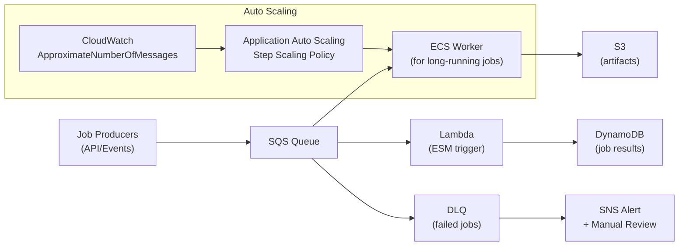

# Queue-Based Auto Scaling Architecture

## Problem Statement
Design a system that scales workers based on SQS queue depth to process variable-volume jobs efficiently.

## Architecture Diagram



## Scaling Formula
```
Target workers = ceil(QueueDepth / TargetMessagesPerWorker)

Example:
- Queue depth: 500 messages
- Target: 10 messages per worker  
- Target workers: 50
- Current workers: 10
- Scale out: +40 workers
```

## Lambda vs ECS for Queue Processing

| Criteria | Lambda | ECS Fargate |
|---------|--------|-------------|
| Job duration | < 15 min | Unlimited |
| Startup time | Fast | ~30s |
| Cost at scale | Per-invocation | Per-hour |
| Exactly-once | No (at-least-once) | Application-managed |
| Use when | Short, bursty jobs | Long, heavy processing |

## Key Patterns
- **Visibility timeout**: must be > Lambda timeout × 6; ECS job time × 2
- **Partial batch failure**: Lambda ESM `ReportBatchItemFailures` response
- **Poison pill**: message failing repeatedly → DLQ after max receive count
- **FIFO queue**: exactly-once processing with deduplication ID

## Interview Talking Points
- "SQS depth metric drives scaling decisions — it's the most direct capacity signal"
- "Visibility timeout is where most developers make mistakes — it must be longer than processing time"
- "DLQ is mandatory for production; never silently drop failed messages"
- "Lambda for short jobs (< 15 min, bursty); ECS for long-running heavy processing"
